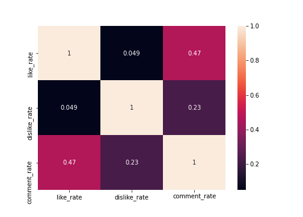

# NLP Analysis of Youtube Tags

Datasets were taken from Kaggle

## Business Case

I will use differnt Count Vectorizer and TF-IDF to predict how many views a YouTube video will render based on the tags used.

## Datasets

The datasets were taken form Kaggle, entitled "Trending YouTube Video Statistics". Datasets from the United States, Canada, and Great Britin were joined together to train this model.

## Exploratory Data Analysis

I started cleaning the dataset by removing all rows with no tags and dropping unneeded columns. I then removed outliers by limiting the dataset to a maximum of 1 million views.

I then examined the distribution of the views count through the following histogram: 

It's clear form the histogram that the number of videos increase as the number of views decrease, which is expected.

Next I assigned category names to the videos beased on the category id's in the dataset using the json files provided with the data. I then plotted the number of videos in each categroy:

Based in the analysis, the most number of videos are in the Entertainment category by far, and the remain categories count descending quite consistently.

I then defined likes, dislike and comment rate based on views by dividing the number of likes, dislikes, and comments by views. I then produced a heatmap comparing the rates of likes and dislikes with comments:

Based on the heat map above, there is a 47% chance for a person to comment on a video they liked and a 23% chance to comment on a vidoe they disliked.

I then viewed the 35 most common tags used in videos, the word cloud below shows this analysis:

## Modeling

For modeling, I began by defineing the tags as the data and views as the target variables. I used two methods for creating a predictive model:

1. Count Vectorizer
2. TF-IDF

After I fit transformed the data, I used Random Forest Regression to visualize the results. I then used GridSearch to further optimize my Mean Squared Error.

## Conclusions

Following are the Random Forest results from the two processing methods:

### CountVectorization-

Train:
R Squared =  0.34
Mean Sqrd Error =  188782.54

Test:
R Squared =  0.18
Mean Sqrd Error =  212470.83

### TF-IDF-

Train:
R Squared =  0.34
Mean Sqrd Error =  189268.34

Test:
R Squared =  0.17
Mean Sqrd Error =  213632.30
